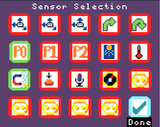

# Experiments:
This guide details 5 potential use cases and experiments you can perform with MicroData:
1. [Electro-magnets](#Electro-Magnometry)
2. [Egg-drop](#Egg-drop)
3. [Botany experiment](#Botany-Experiment)
4. [Noise insulation](#Noise-insulation)

# Egg-drop:
Students need to build a container for their microbit to protect it when dropped from a height. 
The onboard accelerometers will be configured to measure the force that the microbit experienced when it hit the ground.

### Requirements:
One microbit + battery per group, the teacher needs a Microbit + Arcade Shield. 
Cardboard, string, bubblewrap and plastic bags.

# Experiment:
1. Students are split into groups and tasked with using their materials to protect the microbit the best they can.
2. The teacher can use the commander mode to setup the microbit the students are using to record accerelometer data and stream it back to the teachers microbit.
## MicroData setup:
1. 
2. Select 'Start Logging'

3. Select the X, Y, Z accelerometers:

4. Configure the accelerometers to read only when the reading is above 50 using events:

Press A on the first sensor:

Press A on measurements and then use Up and Down. Press A when you are done to confirm:

Move Down to the Period/Event toggle:

Press Left & Right to toggle between modes (Green is active, White is inactive). Then press A to continue:

Use the Up and Down to change the inequality sign to a >:

Press Right, then press Up to change the comparator to 50:

Press Done and repeat the configuration for the other sensors:

3. When you have configured the last sensor the Target microbits that are connected to the Commander will receive their commands to record those 3 accelerometers. You will be brought back to the Commander mode screen. 

The microbit is ready for the experiment!

# Electro-Magnometry:
MicroData lets you leverage the onboard magnometer and analog pins to measure both current and magnetic force in real-time. 
This experiment investigates how the voltage, number of turns of wire and the wires resitance affects the magnetic field of an electro-magnet. 
Student(s) fill out a worksheet that tasks them with building electro-magnets that each have unique specifications - such as a different voltage battery or using a resistor. 

### Requirements:
9 Volt or 12 Volt battery, copper wire, an iron nail. 
Microbit + Arcade Shield. 
Optionally: resistors

# Experiment:
## How to build an electro-magnet:
1. Wrap the copper wire around the iron nail:
[image]

2. Connect one of the ends of wire to the positive terminal and the other end to the negative terminal on the battery:
[image]

## MicroData setup:
1. 

2. 

3. Connect a wire to pin 0 on the Arcade shield

# Tests:
1. What is the reading on the magnometer when using a 9 Volt battery with 30 turns of wire and no resistor?

2. What is the reading on the magnometer when using a 12 Volt battery with 30 turns of wire and no resistor?

3. What is the reading on the magnometer when using a 9 Volt battery with 15 turns of wire and no resistor?

4. What is the reading on the magnometer when using a 9 Volt battery with 15 turns of wire and a 10 ohm resistor resistor?

# Questions:
1. Name one control variable and why it is important.

2. Which setup had the highest reading on the magnometer?

3. Create a graph with the magnometer reading on the y-axis and the number of turns of wire on the x-axis, using the data from the tests that used the 9 Volt battery and no resistor.

# Botany Experiment:
How does the amount of water and the frequency of watering a plant affect its growth?

### Requirements:
Each student or group of students needs a Microbit + Arcade Shield & a soil moisture sensor. 
Student(s) have a unique water plan to follow - for example watering each plant every other day - or giving each plant a small amount of water every day.

### Experiment:​
Each day the student(s) measure the height 

Each day they will follow their water plan and note down the height of the plant. At the end of the experiment the student(s) can make a table in their notebook(s) from the readings saved on the micro:bit and the corresponding height of the plant.​

The student(s) can then share their results with the class to create a full table of data and analyse how a plant's height is affected by how it is watered.​

# Noise insulation:
This experiment investigates the good different materials are at insulating noise. 

### Requirements:
One microbit per group + battery to power it + one Arcade Shield for the teacher. 
Materials with different acoustic qualities such as: cloth, styrofoam, cardboard and plastic. 
A box for the microbit.

## Experiment:
1. Each group places their microbit with its battery into their box.
2. They are tasked with using their material to insulate their microbit from noise as well as they can.
3. The teacher uses the commander mode to make all of the microbits record volume using their microphone for 5 seconds and stream it back to the teachers microbit.
4. All the students can make lots of noise for 10 seconds.
5. The teacher can see which microbit recorded the least noise; pronouncing the winning group.
