# Experiments:
This guide details 4 potential use cases and experiments you can perform with MicroData:
1. [Electro-magnets](#Electro-Magnets)
2. [Micro-drop](#Micro-drop)
3. [Noise insulation](#Noise-insulation)
4. [Biology experiment](#Biology-Experiment)
5. [Ammeter](#Making-an-ammeter)

# Electro-Magnets:
MicroData lets you leverage the onboard magnometer to measure magnetic force from an electro-magnet in real-time. 
This experiment investigates how the voltage, number of turns of wire and distance affect the magnetic field of an electro-magnet. 

[BBC-Bitesize Resource](https://www.bbc.co.uk/bitesize/guides/zvk4t39/revision/6)

### Requirements:
9 Volt or 12 Volt battery, copper wire, an iron nail. 
Microbit + Arcade Shield. 
Optionally: resistors 

# Experiment:
## How to build an electro-magnet:
1. Wrap the copper wire around the iron nail: 
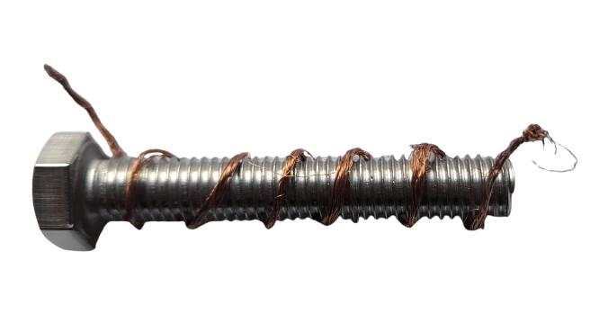

2. Turn your battery off, then connect one of the ends of wire to the positive terminal and the other end to the negative terminal: 
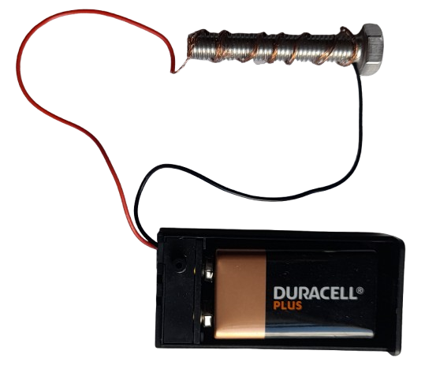

## MicroData setup:
1. On the MicroData home screen click on Real-time Data: 

2. Select the Magnet sensor: 
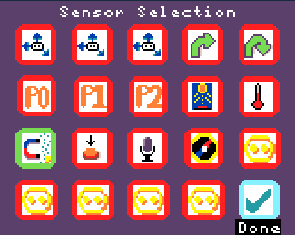

3. Press Done and see the micro-tesla readings from the magnometer: 
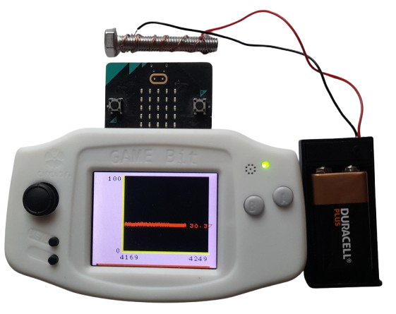

## Tests:
1. What is the base reading on the magnometer when there is no electro-magnet nearby?

2. What is the reading on the magnometer when using a 9 Volt battery with 15 turns of wire, when 5cm away from the microbit?

3. What is the reading on the magnometer when using a 9 Volt battery with 15 turns of wire, when 1cm away from the microbit?

4. What is the reading on the magnometer when using a 9 Volt battery with 30 turns of wire, when 10cm away from the microbit?

5. What is the reading on the magnometer when using a 9 Volt battery with 30 turns of wire, when 5cm away from the microbit?

6. What is the reading on the magnometer when using a 9 Volt battery with 30 turns of wire, when 1cm away from the microbit?

## Questions:
1. Name one control variable and why it was important.
2. Which setup had the highest reading on the magnometer?
3. Create a graph with the magnometer reading on the y-axis and the distance on the x-axis. Using the data from Tests 4, 5 & 6.

# Micro-drop:
Students need to build a container for their microbit to protect it when dropped from a height. 
The onboard accelerometers will be configured to measure the force that the microbit experienced when it hit the ground. 

### Requirements:
One microbit + battery per group, the teacher needs a Microbit + Arcade Shield. 
Cardboard, string, bubblewrap and plastic bags. 

# Experiment:
1. Students are split into groups and tasked with using their materials to protect the microbit the best they can.
2. The teacher can use the commander mode to setup the microbits the students are using to record accerelometer data and stream it back to the teacher.

## MicroData setup:
1. Commander to control the Microbit that will be dropped: 

2. Select 'Start Logging'

3. Select the X, Y, Z accelerometers: 
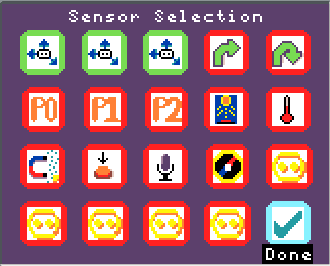

4. Configure the accelerometers to read only when the reading is above 50 using events: 
    4.1. Press A on the first sensor: 
      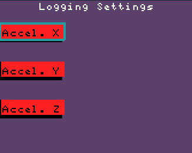
      
    4.2. Press A on measurements and then use Up and Down. Press A when you are done to confirm: 
      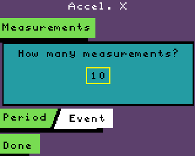
      
    4.3. Move Down to the Period/Event toggle: 
      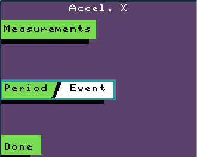
      
    4.4. Press Left & Right to toggle between modes (Green is active, White is inactive). Then press A to continue: 
      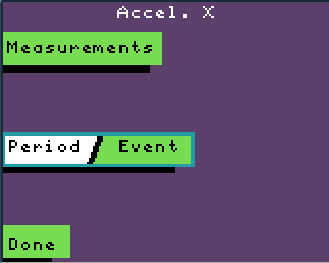
      
    4.5. Use the Up and Down to change the inequality sign to a >: 
      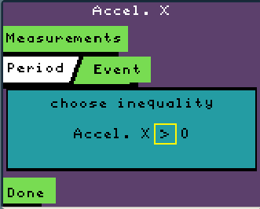
      
    4.6. Press Right, then press Up to change the comparator to 50: 
      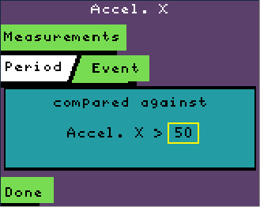
      
    4.7. Press Done and repeat the configuration for the other sensors: 
      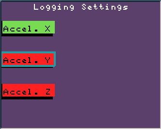

3. When you have configured the last sensor the Target microbits that are connected to the Commander will receive their commands to record those 3 accelerometers. You will be brought back to the Commander mode screen. 

The microbit is ready for the experiment!

## Example build:
1. Get the Microbit and connect it to a battery: 
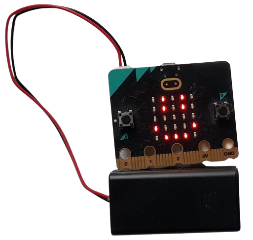

2. Protect the microbit with bubble-wrap: 
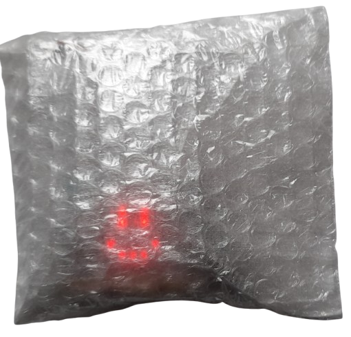

3. Build a make-shift parachute to ease its descent: 
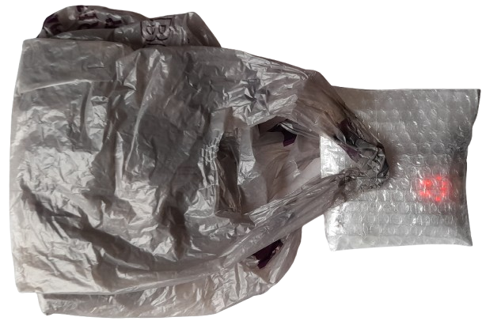

# Noise insulation:
This experiment investigates the good different materials are at insulating noise. 

### Requirements:
One microbit per group + battery to power it + one Arcade Shield for the teacher. 
Materials with different acoustic qualities such as: cloth, styrofoam, cardboard and plastic. 
A box for the microbit.

## Experiment:
1. Each group places their microbit with its battery into their box. 
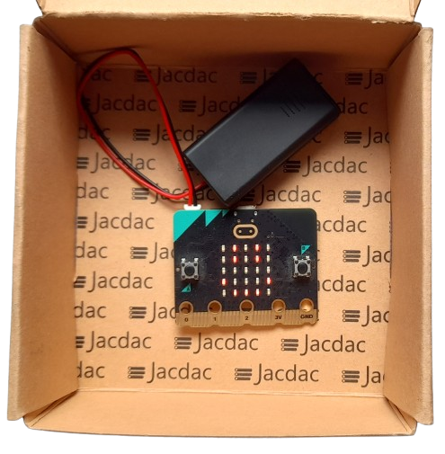

2. They are tasked with using their material to insulate their microbit from noise as well as they can. 
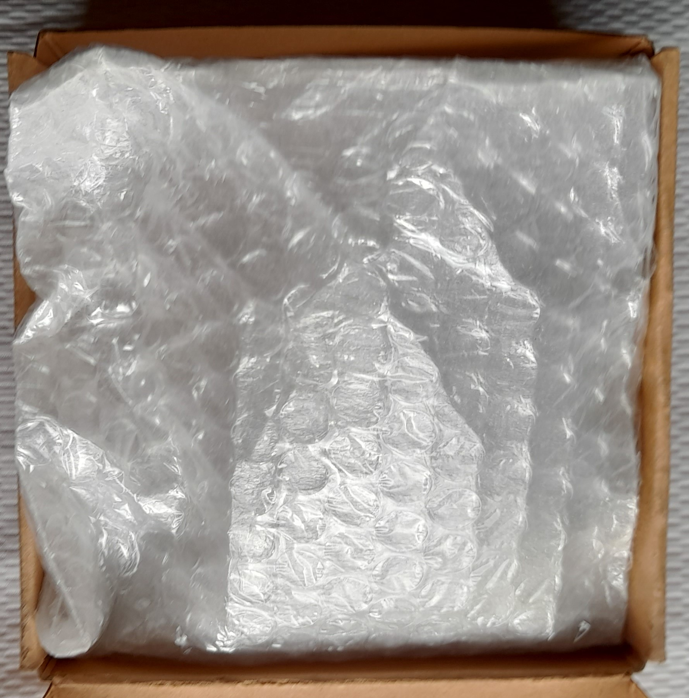

3. The teacher uses the commander mode to make all of the microbits record volume using their microphone for 5 seconds and stream it back to the teachers microbit.

4. All the students can make lots of noise for 10 seconds.

5. The teacher can see which microbit recorded the least noise; pronouncing the winning group.

# Biology Experiment:
How does the amount of water and the frequency of watering a plant affect its growth?

## Requirements:
Each student or group of students needs a Microbit + Arcade Shield & a soil moisture sensor. 
Student(s) have a unique water plan to follow - for example watering each plant every other day - or giving each plant a small amount of water every day.

## Experiment:​
1. Each day the student(s) measure the height of their plant.
2. Each day they will follow their water plan. 
3. At the end of the experiment the student(s) can make a table in their notebook(s) from the readings saved on the micro:bit and the corresponding height of the plant.​
4. The student(s) can then share their results with the rest of the class to create a full table of data and analyse how a plant's height is affected by how it is watered.​

# Making-an-ammeter
How can we turn a voltmeter into an ammeter? Can we use it to explore the relationship between voltage, current & resistance?

## Requirements:
1. A microbit + an Arcade Shield.
2. Wires/crocodile clips.
3. Some resistors.
4. Circuits to measure & make.

# Background:
The bbc micro:bit has 3 pins with which to measure voltage, in addition to a 3V supply and a ground pin. We can use the live data viewer to see the voltage of a circuit in realtime. We cannot directly measure the current of a circuit using a voltmeter, for that we need an ammeter; which we can make using a voltmeter and a resistor.

The equation below tells us the relationship between voltage, current & resistance: 
Voltage (V) = Current (I) * Resistance (R)

If we know two of these variables then we can rearrange this equation to calculate the third one. For example, our voltmeter allows us to read the voltage at a point in a circuit, if we also know the resistance at that point then we can calculate the current: 
Current (I) = Voltage (V) / Resistance (R)

We can use this fact to create an ammeter by using a shunt resistor (a resistor with a known value). We can measure the voltage across this resistor and then plug the numbers into the equation above to calculate the current.

